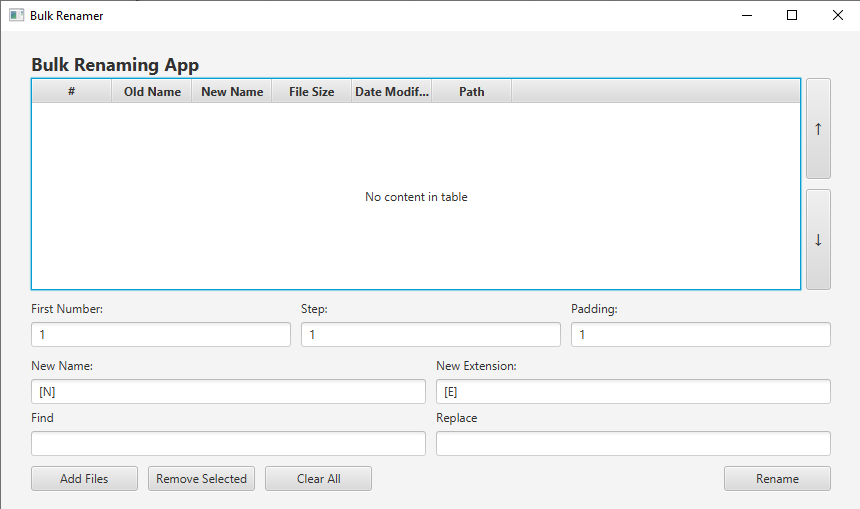

# Bulk Renamer

An app for easy renaming of multiple files

## How to build and run

### Prerequisites

- Java 17
- Maven

## How to run

The app is modularized into 3 modules: app, api and plugins. The app modules contains the main class, the api module contains the interfaces and the plugins module contains the built-in plugins.

The standalone app comes with no plugin functionality, everything is done through the interface. To add plugins, you will need to have a plugins folder in the same directory as the app jar. The plugins folder should contain the plugin jars.

To easily run the app with the default set of plugins, there are 2 scripts, one for linux and one for windows.

On Linux run:
   
```bash
./run.sh
```

On Windows run:

```bash
./run.bat
```

This will build the project in the `dist` folder and run the app, also copy all plugins before running, so they will be activated.

If you wish to build the app yourself, you can run:

```bash
mvn clean package
```

This will build the standard targets in each respective module.

## How to use

The flow of the app is as follows:

1. After opening the app, use the `Add files` button to add files to the list
2. Select the files you want to rename and confirm, this will add them to the list of files
3. Write mask for your files, in the New Name and New Extension fields, you can use the built-in masks, described in the next section.
   1. Optionally, you can use the find and replace feature, that works on the result of the mask
4. Click `Rename` to rename the files
5. If everything went well, you will see a message about the successful renaming

## Default plugins

- \[N] - Name of the file
- \[N#-#] - Name of the file from # to #
- \[E] - Extension of the file
- \[E#-#] - Extension of the file from # to #
- \[D], \[M], \[R] - Current date, as day, month, year
- \[C] - Counter, settings is available in the interface, you can set the starting value, step and number of digits (padding)

## Plugin interface

One can write own plugins/masks for the app.

The program uses the [pf4j](https://github.com/pf4j/pf4j) framework for plugin management.

The plugin interface is defined in the `api` module, if you wish to create your own plugin, I recommend adding a module under the `plugins` module, and follow the same structure as the built-in plugins.

After you built your plugin, you can simply compile the project and copy the plugin jar to the `plugins` folder, and it will be loaded on the next run.

## Images


